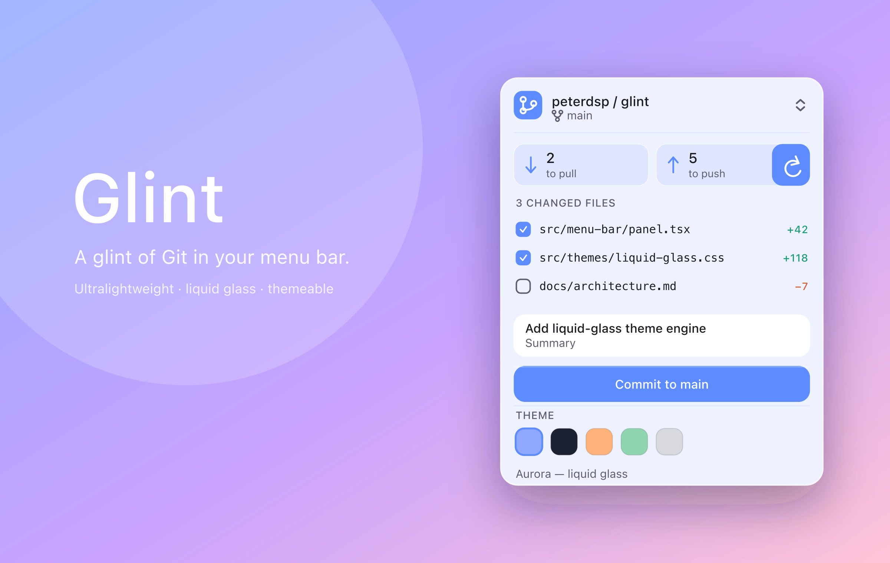
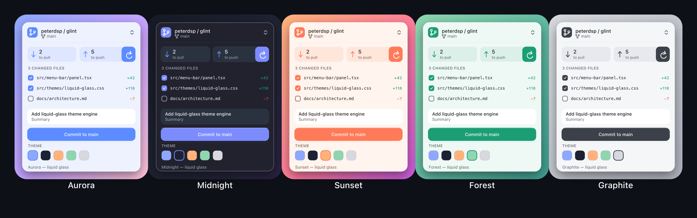

<div align="center">



# Glint

[](LICENSE)

**A glint of Git in your menu bar** - ultralightweight, liquid glass, themeable.

</div>

Glint is a menu-bar Git client: a reimagining of GitHub Desktop's ideas built on
**Tauri + Rust** instead of Electron. It lives in the macOS menu bar, uses native
`NSVisualEffectView` translucency for real liquid glass, and ships swappable
themes as CSS token sets.

- **Tiny.** System webview (WebKit) + a Rust core - no bundled Chromium. Megabytes, not hundreds of them.
- **Glassy.** Native vibrancy behind a transparent webview; themes tint the glass.
- **Menu-bar native.** A tray-positioned panel that toggles on click and dismisses on blur.
- **Yours.** Every theme is a handful of tokens - drop one in and it appears.

## Themes

Same structure, swapped tokens. Light or dark, the glass never changes - only the tint and accent do.

<div align="center">

</div>

## Architecture

```
glint/
├─ src/                     Frontend (system webview) - HTML/CSS/JS, no framework
│  ├─ index.html            The glass panel
│  ├─ styles.css            Glass + theme variables
│  ├─ themes.js             Theme token sets (add themes here)
│  ├─ app.js                Theme switching + Git rendering, calls Rust over IPC
│  └─ vendor/tabler/        Vendored icon webfont (offline, no CDN)
└─ src-tauri/               Rust core
   ├─ src/main.rs           Tray, transparent window, vibrancy, IPC commands
   ├─ src/git.rs            Git status (via `git` CLI - see note below)
   ├─ tauri.conf.json       Window: transparent, borderless, always-on-top
   └─ capabilities/         Permissions
```

The full visual spec lives in **[docs/design-language.md](docs/design-language.md)** -
the glass recipe, radius scale, the seven-token theme model, and the CSS→AppKit
mapping, all pixel-exact to the concept.

### Git backend note

`src/git.rs` currently shells out to the `git` CLI (`status --porcelain=2`) so the
first build is fast and dependency-free. Planned upgrade: migrate to
[`git2`](https://docs.rs/git2) (libgit2 bindings) for in-process reads, then native
`push`/`pull` with credential handling, and `octocrab` for PR status.

## Run it

Prerequisites: Rust, Node (for the Tauri CLI convenience scripts), and
`cargo-tauri` (`cargo install tauri-cli --version '^2'`).

```sh
# from glint/
cargo tauri dev        # or: npm run dev
```

Look for the Glint icon in your menu bar; click it to toggle the panel. Click the
selector in the header to point it at a real repo, or it shows sample data.

## Themes

Each built-in theme is an entry in `src/themes.js` - an accent color, a swatch,
and the glass tint/ink variables. Drop in another object and it appears as a
swatch automatically.

**Your own themes, from disk.** Glint also reads user-authored themes at launch.
Drop a `.json` file into the app config dir's `themes/` folder and it shows up as
a swatch alongside the built-ins:

| OS | Folder |
|---|---|
| macOS | `~/Library/Application Support/dev.peterdsp.glint/themes/` |
| Linux | `~/.config/dev.peterdsp.glint/themes/` |
| Windows | `%APPDATA%\dev.peterdsp.glint\themes\` |

```json
{
  "label": "Nord - arctic",
  "swatch": "#88c0d0",
  "vars": {
    "--accent": "#88c0d0",
    "--tint": "rgba(46, 52, 64, 0.55)",
    "--tint-2": "rgba(255, 255, 255, 0.08)",
    "--field": "rgba(255, 255, 255, 0.10)",
    "--stroke": "rgba(255, 255, 255, 0.18)",
    "--ink": "#eceff4",
    "--ink-2": "#a6adbb"
  }
}
```

The `key` defaults to the file name; invalid files are skipped, never fatal.

## Platforms

Glint targets **macOS, Windows, and Linux**. The glass is native where the OS
provides it - `NSVisualEffectView` on macOS, Mica on Windows - and falls back to
the CSS tint on Linux. The tray glyph is a monochrome template on macOS and the
colored icon elsewhere. Every build is checked on all three in CI.

## Roadmap

- [x] Migrate `git.rs` to `git2`
- [x] Native push/pull + credentials
- [x] PR status via `octocrab`
- [x] Diff / merge-conflict "pop-out" window
- [x] Monochrome template tray icon
- [x] Vendor the icon font (drop the CDN link) for full offline use
- [x] User-authored themes from disk

See the [open issues](https://github.com/peterdsp/glint/issues) for the live backlog.

## License

Copyright (c) 2026 Petros Dhespollari. All rights reserved.

Glint is proprietary, source-visible software. The source may be reviewed for
personal educational purposes, but copying, redistribution, derivative works,
competing use, commercial reuse, AI training, and circumvention of the paid
license system are prohibited without written permission.

Official builds may be used under the end-user terms in [LICENSE](LICENSE).
Third-party components remain under their respective licenses.
